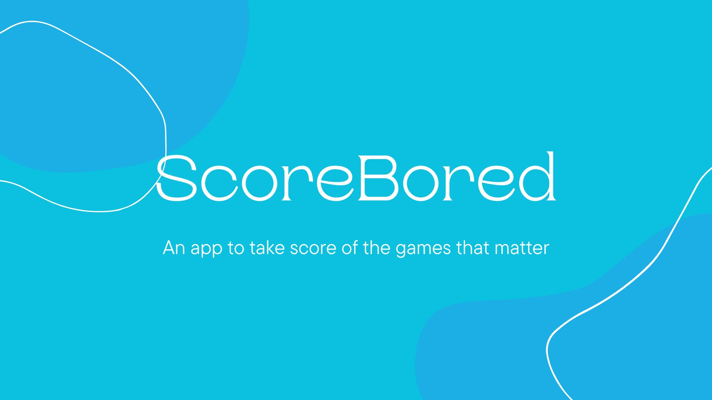

<h2>ScoreBored is an app purely to take note of the scores of a game , such as when playing cards or board games </h2>
 
<h3>To use scorebored , simply go to releases and download the latest release , and install it in an android device or a linux device.</h3>
 
<h4>ScoreBored is a simple flutter app that uses hive for its storage.</h4>
<h4>Feel free to use the code of this repository as you see fit , as this is nothing but a test project , to get a hang of flutter and data storage using hive.</h4>
 
<h4>For any querries regarding ScoreBored , or any other querry regarding flutter or hive, feel free to reach out to me at <a href="suryaghosh1406@gmail.com">suryaghosh1406@gmail.com</a></h4>
<h4>If you wish to see updates and products faster , consider donating , it helps developers like me a lot</h4>
<h3 align="center">Support:</h3>

 
 
<h2>Also Check out <a href='https://github.com/atnakayrus/EZAlternatives'>EZAlternatives</a></h2>